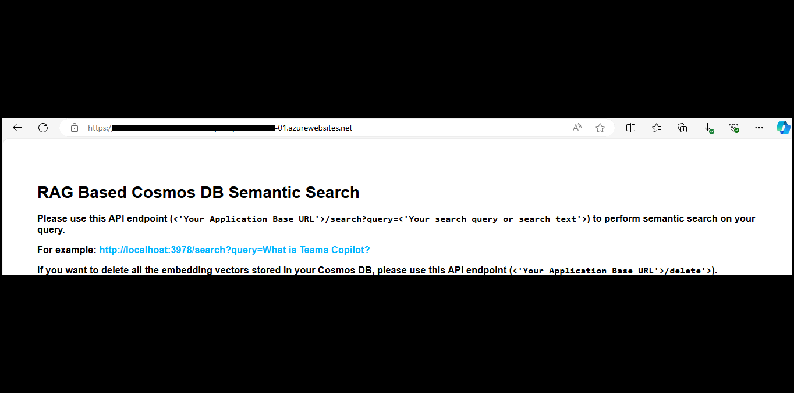
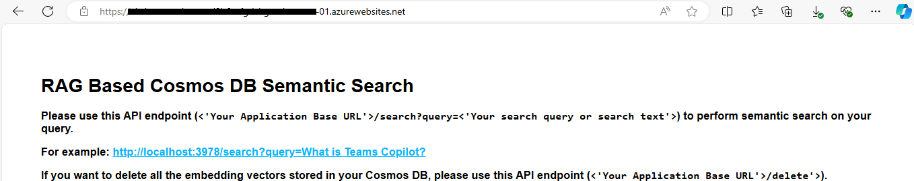
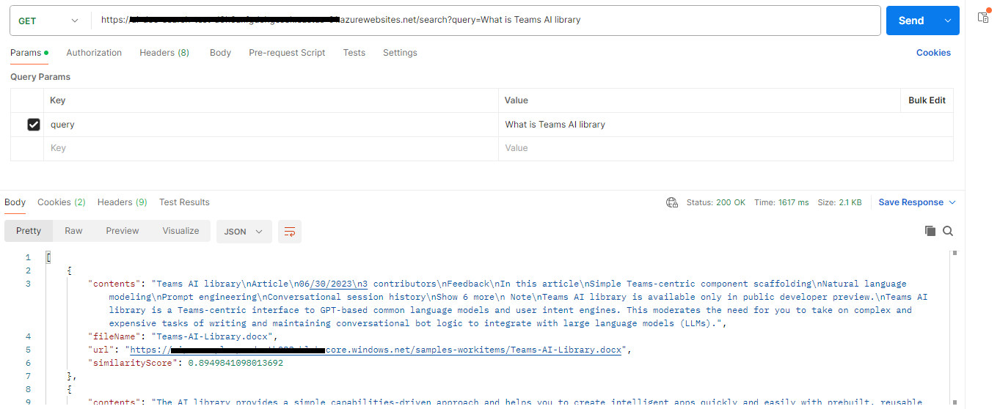
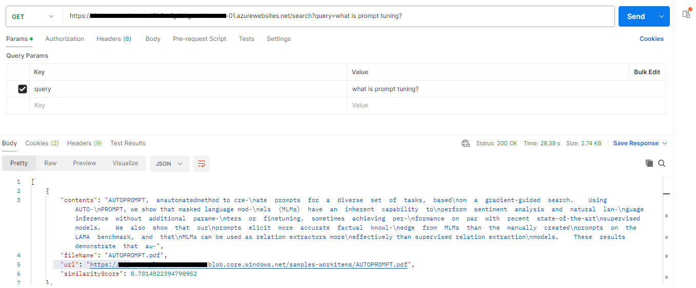
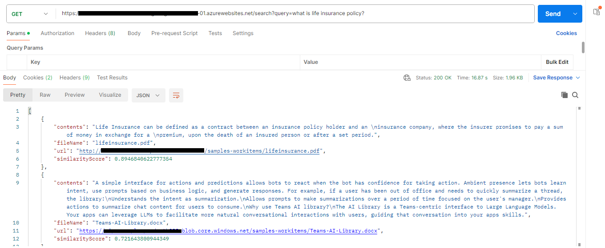
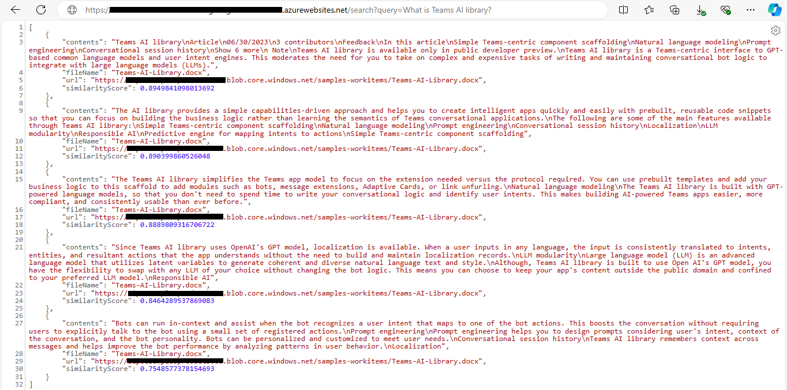
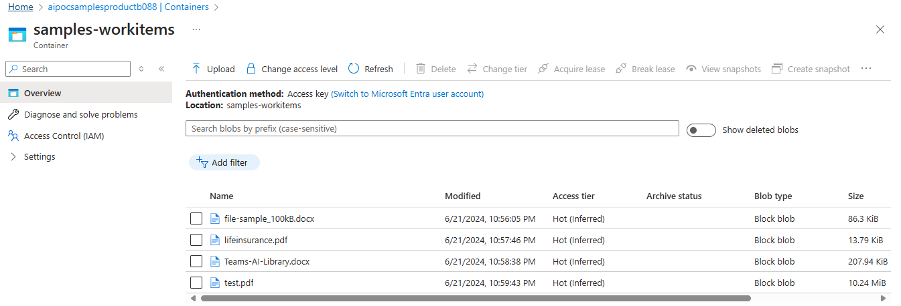
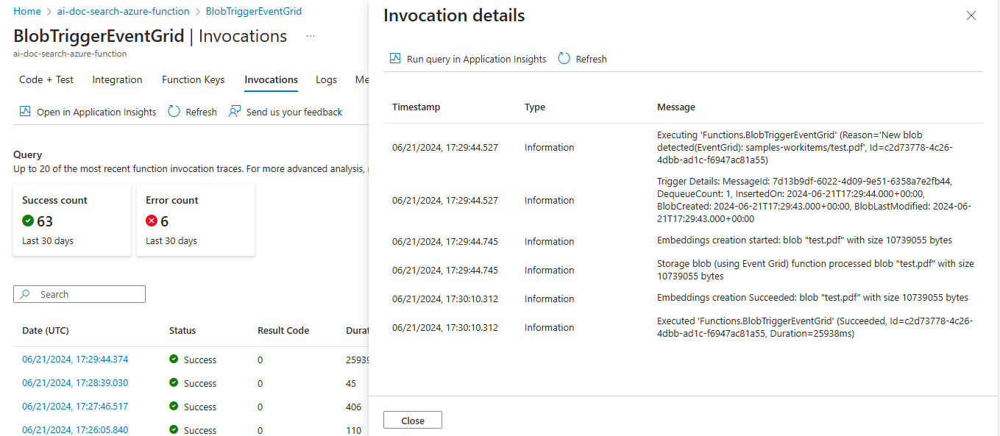
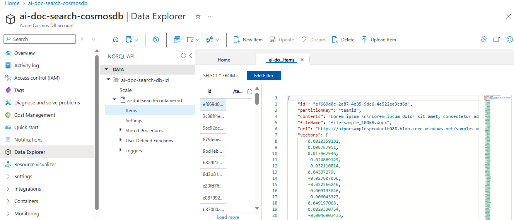
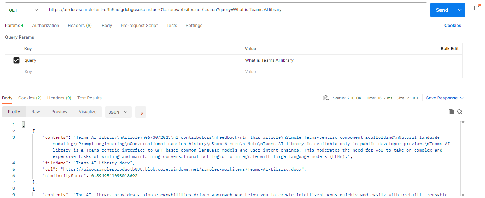

# RAG-based semantic search API using NoSQL CosmosDB

This is a sample application that demonstrates how to perform RAG-based semantic search using CosmosDB.

## Included Features
* Blob based Event Grid Trigger
* Azure Open AI Embeddings
* Vector search based on VectorDistance() function

## Interaction with app



## Prerequisites


- [NodeJS](https://nodejs.org/en/)
- [Azure Open AI Service](https://learn.microsoft.com/en-us/azure/ai-services/openai/overview)
- [Azure CosmosDB](https://learn.microsoft.com/en-us/azure/cosmos-db/nosql/vector-search)
- [Azure Function](https://learn.microsoft.com/en-us/azure/azure-functions/functions-event-grid-blob-trigger?pivots=programming-language-javascript)


- [Azure Blob Storage](https://learn.microsoft.com/en-us/azure/storage/blobs/storage-blobs-introduction)
- [Azure App Insights](https://learn.microsoft.com/en-us/azure/azure-monitor/app/nodejs)
- [Postman or other API testing tool](https://www.postman.com/api-platform/api-testing/)

## Setup the application locally

### Create and configure Azure Cosmos DB for NoSQL

1. **[Create Azure Cosmos DB Account](https://learn.microsoft.com/en-us/azure/cosmos-db/nosql/quickstart-portal#create-account)** in Azure portal and [Enroll in the Vector Search Preview Feature](https://learn.microsoft.com/en-us/azure/cosmos-db/nosql/vector-search#enroll-in-the-vector-search-preview-feature)
  - Create and collect `CosmosDBEndpoint`, `CosmosDBKey`, `CosmosDBDatabaseId`, `CosmosDBContainerId`, `PartitionKey` and save those values in Notepad to update in `.env` file later.


 2. **Create Azure Open AI service**
   - In Azure portal, create a [Azure Open AI servie](https://learn.microsoft.com/en-us/azure/ai-services/openai/how-to/create-resource?pivots=web-portal).

3. **Create Azure Blob storage**

- In Azure portal, create a [Azure Blob storage](https://learn.microsoft.com/en-us/azure/storage/blobs/storage-blobs-introduction).

   

4. **Setup for code**

  - Clone the repository

    ```bash
    git clone https://github.com/OfficeDev/Microsoft-Teams-Samples.git
    ```
  - Navigate to `samples/api-doc-search/api-doc-search` folder and open the project in Visual Studio Code.
  - Open `ai-doc-search` folder and `.env` file.
  - Update the `.env` configuration for the application to use the `AzureOpenAIEndpoint`, `AzureOpenAIApiKey`, `AzureOpenAIDeploymentName`, `CosmosDBEndpoint`, `CosmosDBKey`, `CosmosDBDatabaseId`, `CosmosDBContainerId`, `PartitionKey`, `SimilarityScore`, `APPINSIGHTS_INSTRUMENTATIONKEY`, `APPINSIGHTS_CONNECTIONSTRING` values.
  - In a terminal, navigate to `samples/api-doc-search/api-doc-search`

 - Install node modules and run application via pressing F5 in Visual Studio Code
 - 
   ```bash
    npm install
   ```

    
5. Setup Azure Function
    - 


## Running the sample














## Deploy the sample in Azure environment

[Refer this documentation](https://learn.microsoft.com/en-us/azure/app-service/quickstart-nodejs?tabs=windows&pivots=development-environment-vscode#deploy-to-azure)

## Further reading

- [Azure CosmosDB](https://learn.microsoft.com/en-us/azure/cosmos-db/nosql/vector-search)

- [Vector Search Preview Feature](https://learn.microsoft.com/en-us/azure/cosmos-db/nosql/vector-search#enroll-in-the-vector-search-preview-feature)

- [Azure Open AI Service](https://learn.microsoft.com/en-us/azure/ai-services/openai/overview)

- [Azure Function](https://learn.microsoft.com/en-us/azure/azure-functions/functions-event-grid-blob-trigger?pivots=programming-language-javascript)

- [Azure Blob Storage](https://learn.microsoft.com/en-us/azure/storage/blobs/storage-blobs-introduction)

- [Azure App Insights](https://learn.microsoft.com/en-us/azure/azure-monitor/app/nodejs)


