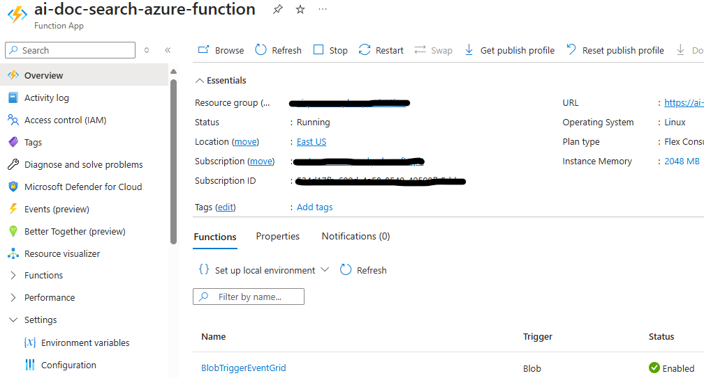

# Setup Azure Function to store embeddings vectors in CosmosDB

## Create Azure Open AI service:
**> Note: You can ignore this step if you have already created Azure Open AI service.**
- In Azure portal, create a [Azure Open AI servie](https://learn.microsoft.com/en-us/azure/ai-services/openai/how-to/create-resource?pivots=web-portal).
- Create and collect `AzureOpenAIEndpoint`, `AzureOpenAIApiKey`, `AzureOpenAIDeploymentName`, and save those values in Notepad to update in `.local.settings.json` file later.

## Create and configure Azure Cosmos DB for NoSQL:
**> Note: You can ignore this step if you have already created Azure Cosmos DB account.**

 - **[Create Azure Cosmos DB Account](https://learn.microsoft.com/en-us/azure/cosmos-db/nosql/quickstart-portal#create-account)** in Azure portal and [Enroll in the Vector Search Preview Feature](https://learn.microsoft.com/en-us/azure/cosmos-db/nosql/vector-search#enroll-in-the-vector-search-preview-feature)
  
 - Create and collect `CosmosDBEndpoint`, `CosmosDBKey`, `CosmosDBDatabaseId`, `CosmosDBContainerId`, `PartitionKey` and save those values in Notepad to update in `.local.settings.json` file later.

## Create Azure Blob storage:
**> Note: You can ignore this step if you have already created Azure Blob storage.**

- In Azure portal, create a [Azure Blob storage](https://learn.microsoft.com/en-us/azure/storage/blobs/storage-blobs-introduction).
- - Create and collect `AzureStorageDBConnString`, `AzureBlobContainerName`, and save those values in Notepad to update in `.local.settings.json` file later.

## Create the event subscription:
**> Note: Please follow below documentation carefully to make your Azure function up and running.**

- [Create the event subscription](https://learn.microsoft.com/en-us/azure/azure-functions/functions-event-grid-blob-trigger?pivots=programming-language-javascript#create-the-event-subscription).

- [Trigger Azure Functions on blob containers using an event subscription](https://learn.microsoft.com/en-us/azure/azure-functions/functions-event-grid-blob-trigger?pivots=programming-language-javascript#create-the-event-subscription).

## Setup for code:

  - Clone the repository

    ```bash
    git clone https://github.com/OfficeDev/Microsoft-Teams-Samples.git
    ```
  - Navigate to `samples/api-doc-search/azure-function-nodejs` folder and open the project in Visual Studio Code.
  - Open `.local.settings.json` file and update the `.local.settings.json` configuration for the application to use the `AzureOpenAIEndpoint`, `AzureOpenAIApiKey`, `AzureOpenAIDeploymentName`, `CosmosDBEndpoint`, `CosmosDBKey`, `CosmosDBDatabaseId`, `CosmosDBContainerId`, `PartitionKey`, `SimilarityScore`, `APPINSIGHTS_INSTRUMENTATIONKEY`, `APPINSIGHTS_CONNECTIONSTRING` values.
  - 
  - In a terminal, navigate to `samples/api-doc-search/azure-function-nodejs`

 - Install node modules and run application via pressing F5 in Visual Studio Code
 - 
   ```bash
    npm install
   ```

## Running the sample

[Prepare local storage emulation](https://learn.microsoft.com/en-us/azure/azure-functions/functions-event-grid-blob-trigger?pivots=programming-language-javascript#prepare-local-storage-emulation)

[Run the function locally](https://learn.microsoft.com/en-us/azure/azure-functions/functions-event-grid-blob-trigger?pivots=programming-language-javascript#run-the-function-locally)

[Upload a file to the container](https://learn.microsoft.com/en-us/azure/azure-functions/functions-event-grid-blob-trigger?pivots=programming-language-javascript#upload-a-file-to-the-container)

- **Azure Opne AI deployed model:**


- **Blob Container:**


- **Azure Function:**


- **Azure Function Invocation:**

  
- **Cosmos DB Embeddings:**


## Deploy the sample in Azure environment

[Refer this documentation](https://learn.microsoft.com/en-us/azure/azure-functions/functions-event-grid-blob-trigger?pivots=programming-language-javascript#deploy-your-function-code)

## Further reading

- [Azure CosmosDB](https://learn.microsoft.com/en-us/azure/cosmos-db/nosql/vector-search)

- [Vector Search Preview Feature](https://learn.microsoft.com/en-us/azure/cosmos-db/nosql/vector-search#enroll-in-the-vector-search-preview-feature)

- [Azure Open AI Service](https://learn.microsoft.com/en-us/azure/ai-services/openai/overview)

- [Azure Function](https://learn.microsoft.com/en-us/azure/azure-functions/functions-event-grid-blob-trigger?pivots=programming-language-javascript)

- [Azure Blob Storage](https://learn.microsoft.com/en-us/azure/storage/blobs/storage-blobs-introduction)

- [Azure App Insights](https://learn.microsoft.com/en-us/azure/azure-monitor/app/nodejs)

- [Trigger Azure Functions on blob containers using an event subscription](https://learn.microsoft.com/en-us/azure/azure-functions/functions-event-grid-blob-trigger?pivots=programming-language-javascript#deploy-your-function-code)